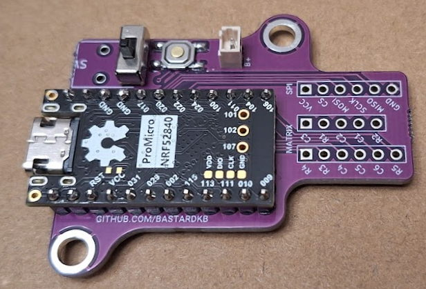
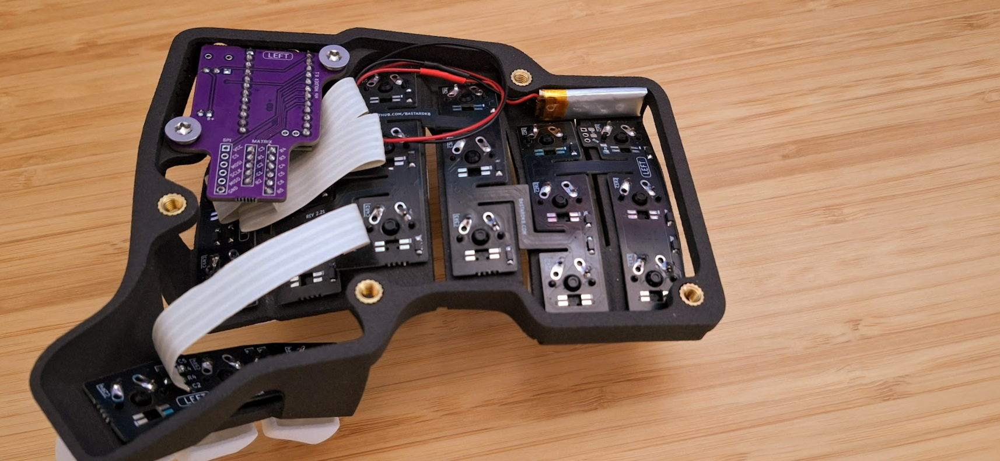
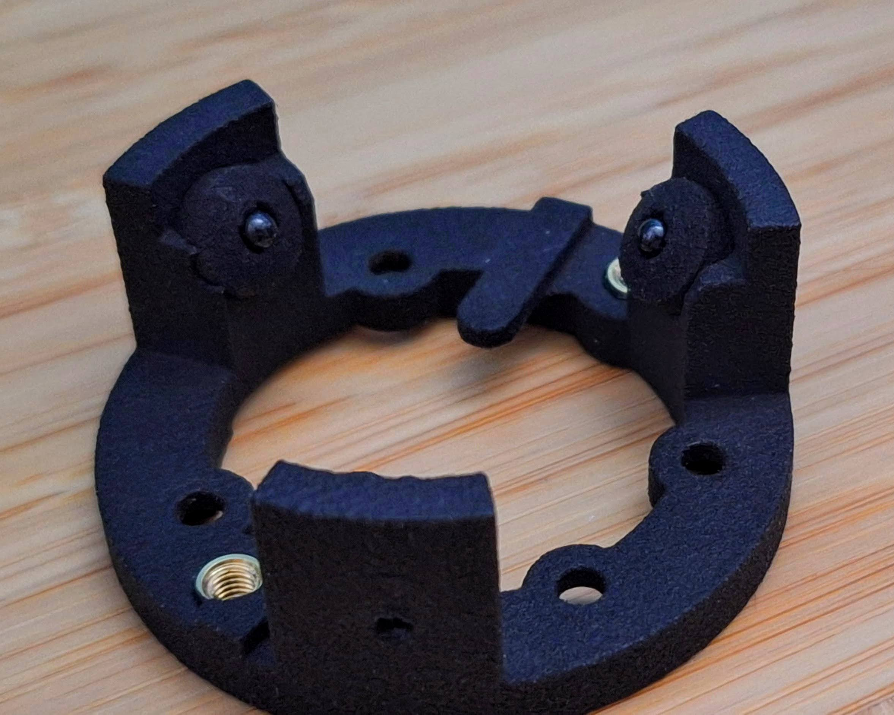

# Wireless Charybdis Mini (3x6) Build Guide

# Intro

This repository is a comprehensive build guide for the Charybdis keyboard, which is an open source, ergonomic keyboard created by [Bastard Keyboards](https://github.com/Bastardkb/Charybdis) and graciously shared with the community.

This guide is a log of all the steps I took in my build process, and for the most part is just a long winded version of Eren Atas' [supremely helpful build guide](https://github.com/erenatas/charybdis-wireless-3x6/blob/master/README.md).

**Join the Community**

For any questions, clarifications, or simply to connect with fellow Charybdis builders, feel free to join the Bastard Keyboards [Discord community](http://www.bstkbd.com/discord).

**Disclaimer**

This guide serves as a resource to assist you in building your Charybdis. I assume no responsibility for any damages or malfunctions that may occur during the build process.

# Build Guide

## Bill of Materials

These are all the components that need to be ordered to build the keyboard. The quantity column denotes how many of each component are required for the build, not how many of each item to buy at the provided link. For example, each PCB ordered from JLCPCB has a minimum order of five, when only one or two are required. So even though the quantity says two, you'll only have to order one because it comes with five PCBs. For each link, adjust your order accordingly, so it matches the minimum required component quantity.

### PCBs

| **Part**                                                                                                 | **Quantity** |
| -------------------------------------------------------------------------------------------------------- | ------------ |
| [PMW3610 Breakout](https://github.com/victorlucachi/charybdis-pmw3610-breakout/tree/nicenano/production) | 1            |
| [Nano Holder](https://github.com/olidacombe/Elite-C-holder/tree/nicenano/adapter/production)             | 2            |
| [Thumb Right (0.8 thickness)](https://github.com/Bastardkb/Charybdis-PCB-thumbs/releases/tag/2.01)       | 1            |
| [Thumb Left (0.8 thickness)](https://github.com/Bastardkb/TBK-Mini-PCB-thumb-cluster/releases/tag/2.1)   | 1            |
| [Plate (0.8 thickness)](https://github.com/Bastardkb/TBK-Mini-PCB-plate/releases/tag/2.21)               | 2            |

I ordered the PCBs from [JLCPCB](https://jlcpcb.com/).

:warning: &emsp; **A thickness of 0.8 or less** must be set for the left thumb, right thumb, and plate PCBs.

The gerber files have all been pulled from other repositories and are stored in the PCB Gerber Files directory. However, each source repository is linked in the part list above for reference.

:information_source: &emsp; An alternative to victorlucachi's PMW3610 breakout design linked above is the [sensor board designed by Bastard Keyboards](https://docs.bastardkb.com/help/bluetooth.html#sensor). I have not used this design yet, but I plan to try it out in the future.

### 3D Case Prints

| **Part**                                                                                                                         | **Quantity** |
| -------------------------------------------------------------------------------------------------------------------------------- | ------------ |
| [Right Plate](https://github.com/Bastardkb/Charybdis/blob/3908164/files/3x6%20mini/plate_v1_v11.stl)                             | 1            |
| [Left Plate](https://github.com/erenatas/charybdis-wireless-3x6/blob/master/3d-prints/plate_v3_v29_mirrorred.stl)                | 1            |
| [Right Case](https://github.com/Bastardkb/Charybdis/blob/2dad0ca/files/3x6%20mini/CMini_v1_v11.3mf)                              | 1            |
| [Left Case](https://github.com/erenatas/charybdis-wireless-3x6/blob/master/3d-prints/case_v3_v29_mirrorred.stl)                  | 1            |
| [Sensor Cover](https://github.com/Bastardkb/Charybdis/blob/9130a58/files/sensor_cover_v51.stl)                                   | 1            |
| [Adapter Top](https://github.com/Bastardkb/Charybdis/blob/c818c76/files/3x5%20nano/adapter_v2_top_v75.stl)                       | 1            |
| [Adapter Bottom](https://github.com/Bastardkb/Charybdis/blob/d0e20cc/files/mods/btu/adapter_btu_bottom_v32.stl)                  | 1            |
| [Ball Bearing Holder](https://github.com/Bastardkb/Charybdis/blob/322faad/files/mods/printable-btu/printable_btu_2.5mm_ball.stl) | 3            |

I ordered these parts from [JLC3DP](https://jlc3dp.com/3d-printing-quote) in SLS black 3201PA-F Nylon. After the order was reviewed I was warned that some of the parts were too thin and may bend or break during production. The risks were accepted and the parts arrived without issue.

The files for these are in the 3D Print STL Files directory, and the source repos have been linked in the parts list above.

After using the keyboard I reckon if I do this again I'll print the plates in SLM(metal) to add a bit of weight for a better typing feel, and to keep the keyboard flat against the desk. The nylon cases and plates can bend slightly, which makes typing on the corner keys push it off balance some of the time.

### 3D Key Cap Prints

| **Part** | **Quantity** |
| -------- | ------------ |
| r1       | 2            |
| r2       | 2            |
| r3       | 2            |
| thumb    | 1            |

The key caps are DES profiled. These were designed by [pseudoku](https://github.com/pseudoku/PseudoMakeMeKeyCapProfiles), and the key set files in this repo will print sets of 10 keys for row one, two, and three, and a single set of ergo thumb keys. Row two will have home dots for the keys that go under each index finger.

JLC3DP SLS printed these in white 1172Pro Nylon. My intent with the white is to dye them later on.

I was sent the same warning about parts being too thin and possible breaking/misprint during production, but again the risks were accepted, and they arrived without any issues. The combination of the texture of the SLS prints and the shape of the DES profile is very comfortable to type on.

Note - JLC3DP charges per-part, and only allows combining a maximum of 10 small parts into a single print, which is why the sprues are included in the STL files. This means that each order is 10 keys for rows 1-3 and six keys for the thumbs.

If you have different printing requirements/capabilities, the OpenSCAD code in this [fork](https://github.com/280Zo/PseudoMakeMeKeyCapProfiles) can be changed by updating the keeb.scad file to render whatever keys you like, with or without sprues, and with or without home dots. If more than one set of rows is rendered at a time, and sprues are enabled, the sprues will be meshed in a grid.

### PMW3610 Sensor

| **Part**                                                                                    | JLCPCB Part #                                                                | MFR. Part #       | **Quantity** |
| ------------------------------------------------------------------------------------------- | ---------------------------------------------------------------------------- | ----------------- | ------------ |
| [PMW3610 module with lens (LM18-LSI)](https://www.aliexpress.us/item/3256806022278018.html) | N/A                                                                          | N/A               | 1            |
| [LDO](https://www.mouser.com/ProductDetail/595-TLV70018DDCR)                                | [C79924](https://jlcpcb.com/partdetail/TexasInstruments-TLV70018DDCR/C79924) | TLV70018DDCR      | 1            |
| [Thick Film Resistor](https://www.mouser.com/ProductDetail/303-0603WAF2004T5E)              | [C22976](https://jlcpcb.com/partdetail/23703-0603WAF2004T5E/C22976)          | 0603WAF2004T5E    | 1            |
| [Ceramic Capacitors](https://www.mouser.com/ProductDetail/187-CL10A105KB8NNNC)              | [C15849](https://jlcpcb.com/partdetail/16531-CL10A105KB8NNNC/C15849)         | CL10A105KB8NNNC   | 1            |
| [Ceramic Capacitors](https://www.mouser.com/ProductDetail/603-CC603KRX7R9BB104)             | [C14663](https://jlcpcb.com/partdetail/Yageo-CC0603KRX7R9BB104/C14663)       | CC0603KRX7R9BB104 | 1            |
| [Ceramic Capacitors](https://www.mouser.com/ProductDetail/187-CL10A475KO8NNNC)              | [C19666](https://jlcpcb.com/parts/componentSearch?searchTxt=C19666)          | CL10A475KO8NNNC   | 7            |

These are all the components required for the sensor breakout PCB. It's possible to have JLCPCB assemble the PCB and components for you. Just select that option at checkout and supply the bom.csv and positions.csv from the PMW3610 Breakout zip.

I chose to solder the parts on myself so I ordered the parts above. A diagram of where to solder each component on is in the assembly instructions.

:information_source: &emsp; Note that part number [C79924](https://jlcpcb.com/partdetail/TexasInstruments-TLV70018DDCR/C79924)/TLV70018DDCR is a substitute for [C146366](https://jlcpcb.com/jp/partdetail/TOSHIBA-TCR2EF19_LMCT/C146366)/TCR2EF19,LM(CT) which is what the designer of the PCB originally used. Either component will work, but if you plan to have JLCPCB assemble the sensor board the C146366 is what's included in the parts list and it is often out of stock. However, the replacement is normally available which is why it's used above.

### General Components

| **Part**                                                                                                                                                               | **Quantity**                            |
| ---------------------------------------------------------------------------------------------------------------------------------------------------------------------- | --------------------------------------- |
| [Trackball](https://www.amazon.com/Perixx-18021-PERIPRO-303GR-Trackball-Compatible/dp/B071NX7Y2J)                                                                      | 1                                       |
| [SuperMini NRF52840 Microcontrollers](https://www.aliexpress.us/item/3256805848952479.html?gatewayAdapt=glo2usa)                                                       | 2                                       |
| [Mill Max Low Profile Sockets 315-43-112-41-003000 (optional)](https://www.mouser.com/ProductDetail/Mill-Max/315-43-112-41-003000?qs=s8Nb1z4Wn%2FRfWrVqQ0TOuQ%3D%3D)   | 4                                       |
| [Mill Max Pins 3320-0-00-15-00-00-03-0 (optional)](https://www.mouser.com/ProductDetail/Mill-Max/3320-0-00-15-00-00-03-0?qs=s8Nb1z4Wn%2FQ16WBIwCPrTw%3D%3D)            | 48                                      |
| [1N4148W Signal Diodes](https://www.amazon.com/gp/product/B079KJX5J9/ref=ox_sc_act_title_1?smid=A14FP9XIRL6C1F&psc=1)                                                  | 41                                      |
| [Button (4x4x1.5)](https://www.aliexpress.us/item/2255800859820067.html?gatewayAdapt=glo2usa4itemAdapt)                                                                | 2                                       |
| [Mini Toggle Switch SPDT 3mm](https://www.amazon.com/Position-Breadboard-Electronic-Miniature-SlideSwitch/dp/B09R42XQTB)                                               | 2                                       |
| [3.7V 130mAh 401030 Li-Po Batteries](https://www.aliexpress.us/item/3256805609268740.html?)                                                                            | 2                                       |
| [2.5mm Silicon Nitride Ceramic Ball Bearings](https://www.aliexpress.us/item/2255799954006155.html)                                                                    | 3                                       |
| [80MM Flexible Flat Cables (Flexstrip Jumper)](https://www.aliexpress.us/item/3256803312420217.html)                                                                   | 2 - 6 pin   2 - 5 pin   2 - 4 pin |
| [100MM Flexible Flat Cables (Flexstrip Jumper)](https://www.mouser.com/ProductDetail/TE-Connectivity/FSN-24A-15?qs=sGAEpiMZZMv0DJfhVcWlK2hMVXoZwMunw%2Fzfkr%2F5Lgc%3D) | 2                                       |
| [Gateron oil king 2.0 switch three-layer pin self-lubricating linear handle 55gf Key Switches](https://www.aliexpress.us/item/3256806388542736.html)                   | 41                                      |
| [M3 x D5 x L5 Brass Melt Nuts](https://www.aliexpress.us/item/3256805371193370.html)                                                                                   | 5                                       |
| [M4 x D6 x L5 Brass Melt Nuts](https://www.aliexpress.us/item/2255800046610840.html)                                                                                   | 12                                      |
| [M3 8mm Torx Screws](https://www.aliexpress.us/item/2251832820627860.html)                                                                                             | 5                                       |
| [M4 8mm Torx Screws](https://www.aliexpress.com/item/2251832820627860.html)                                                                                            | 12                                      |
| [JST plug 2-pin](https://www.aliexpress.com/item/2251832721663484.html)                                                                                                | 2                                       |
| [Adhesive bumper pads](https://www.amazon.com/Shintop-Furniture-Bumpers-Protection-Hemispherical/dp/B01DU0O00W)                                                        | 10                                      |

The parts above were mostly ordered from Aliexpress and Amazon. If the links go to a listing that's no longer active, just search for something with the same description and specs.

The standard for microcontrollers on wireless keyboard builds is the nice!nano 2.0. However, there are some cheaper alternatives documented on [this MCU wiki](https://github.com/joric/nrfmicro/wiki/Alternatives). This build uses the SuperMini NRF52840.

You can order whatever battery you like, it just needs to be 3.7v and more than 80mAh. If you want it to fit under the micro controller, make sure the dimensions are correct. You'll also need to use the optional header sockets. You can get away with using [diode legs](https://docs.splitkb.com/hc/en-us/articles/360011263059-How-do-I-socket-a-microcontroller#h_f7045b1e-5c02-4c73-8569-252b7fce7ad6) instead of socket pins, but they will not be as sturdy. Stick with the pins if you plan to disconnect the MCU often.

The cable length requirements for the flex strip cables varies between components

- Nice!Nano Holder: &nbsp; 75mm
- Thumb Plates: &emsp; &emsp; 80mm
- PMW3610 Sensor: &nbsp; 100mm

The cables can be a bit longer or shorter, but sticking close to these lengths will make installation much easier. The parts list above uses 89mm for both the thumb plates and Nice!Nano holders, and 100mm for the sensor. You can order higher pin counts and cut the strips down or try to find exact pin count and length for each cable.

## Tool List

- Soldering iron with a fine tip and adjustable temperatures
- Solder
- Solder wick and desoldering pump
- ESD safe tweezers
- Kapton tape
- Double sided tape
- Torx screw drivers (T10 and T20)
- Scissors
- Flush cutting pliers
- (optional) ESD mat and strap
- (optional) filter fan
- (optional) flux
- (optional) shrink wrap for battery connection
- (optional) self closing tweezers or kelly forceps
- (optional) magnifying glass or microscope

## Assembly

Bastard Keyboard's build guides are excellent and comprehensive. Their documentation will be linked as much as possible in the steps below.

**Melt nuts**

Follow BastardKB's [build guide to install screw inserts on the cases](https://docs.bastardkb.com/bg_charybdis/04screw_inserts.html).

Then follow their [build guide to install screw inserts on the sensor assembly](https://docs.bastardkb.com/bg_charybdis/11sensor_assembly.html#preparing-the-3d-holder-assembly).

**Diodes**

BastardKB's documentation on how to [solder diodes on both plates and thumb clusters](https://docs.bastardkb.com/bg_charybdis/05diodes.html).

**Sensor Breakout Components (optional)**

If you've chosen to solder the components on the PMW3610 breakout PCB, follow the diagram below to get them in the correct spots.

A stand with a magnifying glass, or a digital microscope are very helpful when trying to ensure the soldering is done correctly on these small components.

**PMW3610**

The lens of the sensor should be removed or covered with Kapton tape while soldering. Orient the sensor so that the back of it is on the same side as the other components, then solder it in place.

When working with the sensor and the MCU it's best to keep soldering iron temperatures below 300°C.

**Nice!Nano Holder Components**

Solder on the switches, and buttons to the left and right nano holder PCBs. Then solder on the JST female connectors. I positioned this so the red wire on the male side would be the battery's positive connection. I also had to bend the legs out a little bit in order to get each one to fit flush with the nano holder board.

**MCU**

Solder the MCUs to the nano holders using the standard pin headers or the socketed pin headers, depending on what you chose to order to mount the MCU.

The MCUs should be face down (components facing towards the nano holder PCB), and the top through holes on either side of the USB connector will not have a spot on the nice!nano PCB.

:warning: &emsp; As mentioned above, do not set your soldering iron any higher than 300°C.

After the components have all been soldered, it should look something like the picture below.

Being careful to not short any connections, connect the JST battery connections, turn the switch to the on position, and confirm the MCU powers on.

If all goes well, unplug the battery and continue the assembly.

**Cables**

If you want the cables a different color, make sure to paint them before this step. Use some tape to cover the tips so they can still be soldered.

Use [BastardKB's documentation](https://docs.bastardkb.com/bg_charybdis/07ribbon_cables.html#cutting-the-cables) on how to cut and solder the ribbon cables.

Then follow the [BastardKB docs](https://docs.bastardkb.com/bg_charybdis/09cables_to_splinky.html) on how to connect all of the PCBs together.

Make sure to use the flush cut pliers to remove any protruding pins and solder from the back side of the PCBs so that they can sit flush with the cases when the switches are being soldered in.

For my build, I had some extra socketed pin headers laying around, so I chose to socket the sensor board to the nano holder with some 28 gauge wire I pulled out of an Ethernet cable. However, the 100mm ribbon cable from the BOM will probably look better, and work just fine as well.

**Battery**

Most builds mount the battery under the MCU, however I opted to mount it on the top lip of each case with some double sided tape.

The fit is perfect and I haven't had any issues with it in this location.

This allowed me to keep the battery away from components that could be damaged with excessive heat or expansion, and makes it easy to examine if I need to see the battery. The slack in the cable also makes it simple to change or remove the battery at any time.

**Testing**

Now that everything is connected follow [BastardKB's documentation](https://docs.bastardkb.com/bg_charybdis/10install_the_switches.html#testing-the-pcbs) to test the switch pads and internal connections.

**Switches**

Once all the switch pads have been confirmed to work, solder in the switches by following [BastardKBs documentation](https://docs.bastardkb.com/bg_charybdis/10install_the_switches.html#installing-the-switches).

**Sensor PCB**

Put the sensor cover into the right case, install the BTU ball holders into the BTU bottom adapter, then screw the BTU bottom adapter into the sensor cover.

Make sure to push the BTU ball holders all the way into the BTU bottom adapter. It should something like this.

Finally, install the sensor PCB and sensor cover by screwing them into the BTU bottom adapter.

**Pads**

Install the anti-slip pads on to the bottom of each plate.

**Final Test**

Install the key caps, then connect each half to the computer the same way you did for the previous test. Confirm that each key still works.

# Dye the Key Caps

Rit DyeMore synthetic fiber dyes are an effective way to color the white nylon key caps to any color you'd like. You'll need a few things before you get started.

**Tools & Supplies**
- Rit DyeMore dye(s)
  - Use their [color formula picker](https://www.ritdye.com/color-formulas/) to figure out which dye to order
- A container to hold the water and dye while it's at temperature
- Something to hold the parts in the dye (the nylon keys will float without this)
- Tongs to get the parts out of the hot dye solution
- Stove or cooktop
- Thermometer

**Process**

1. Mix the dye and water according to the color formula and dye instructions. Adjust the ratios to match the volume of your container.
2. Heat the solution up to ~60°C/140°F. Be careful not to go above 71°C/160°F or the nylon parts might start to deform.
3. Put the parts into the solution, and put the mesh basket top down over the parts so the mesh base is at the top preventing parts from floating.
4. Submerge for five minutes (less if you'd like a lighter shade of the color)
5. While the parts of being dyed, fill a separate container with cold water.
6. When the parts are ready, remove them from the hot solution to the container of cold water.
7. After the parts have cooled, dry them off

**Notes**

- I recommend making small batches of the dye solution and testing the color on a couple of keys to make sure you like it.
- To keep the dye batches small, and to have an easy way to keep the keys in the solution, I used a small [tempura deep frying pot](https://www.amazon.com/dp/B01EHXPT2Y?psc=1&ref=ppx_yo2ov_dt_b_product_details). I took the handle off the mesh basket and turned it upside down so it would hold the parts in the solution.
- I've dyed key caps in crimson red, gray (Crowned Prince), and blue (Flight Plan). I'll attach some picture soon.

# WIP

I'll be adding content for some additional steps soon:
- How to configure the firmware
- How to flash the firmware
- Key layouts

# Credits
This was my first keyboard build, and I couldn't have done it without the hard work from many others:
- [BastardKB](http://bastardkb.com/)
- [erenatas](https://github.com/erenatas/charybdis-wireless-3x6/blob/master/README.md)
- [pseudoku](https://github.com/pseudoku/PseudoMakeMeKeyCapProfiles)
- [toniz4](https://github.com/toniz4/PseudoMakeMeKeyCapProfiles)
- [VOID](https://github.com/victorlucachi)
- [olidacombe](https://github.com/olidacombe)
- [EIGA](https://www.youtube.com/watch?v=Mks7QDxFreY)
